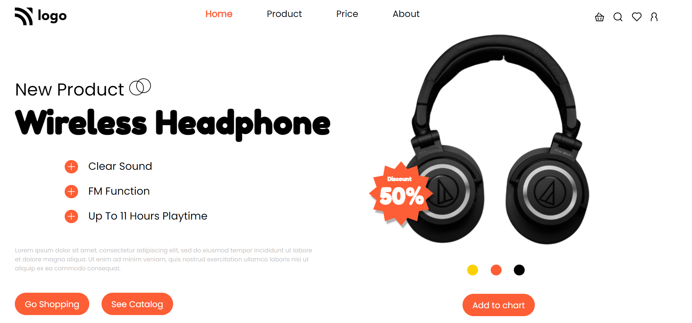

# Mohan Chindam

- I started using the flexbox box property in this project, about which I know something.
- Learnt new skills like drop-shadow on images, which is pretty interesting, just like box-shadow.
- Polished my positioning skills and color, font selection other skills. 
- Positioning of elements took less time in this project because of flexbox.
- Took nearly three hours to three and a half hours to finish the web page design.
- Website is mobile responsive

- Below image shows the preview of the project:

I deployed the project on **Netlify**:
- You can preview the project here, [**Product Home Page**](https://product-home-page-7.netlify.app/)

